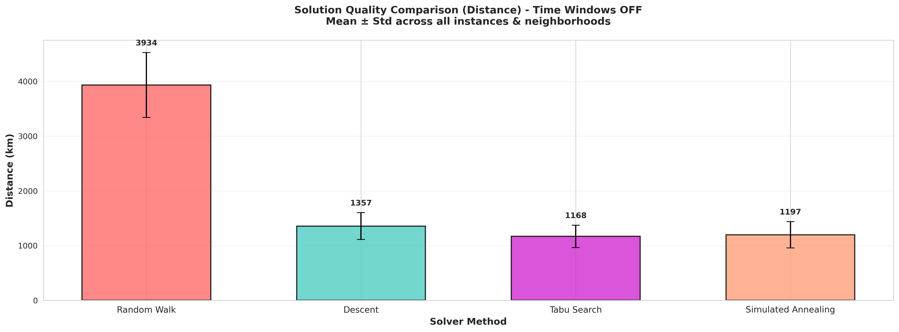
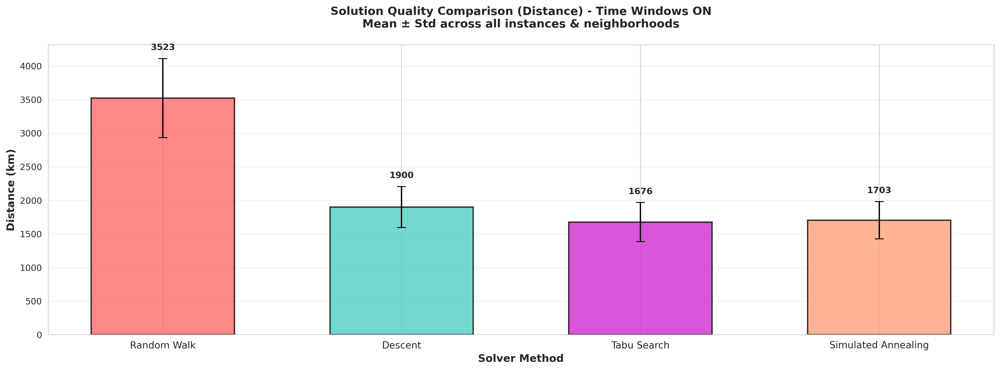
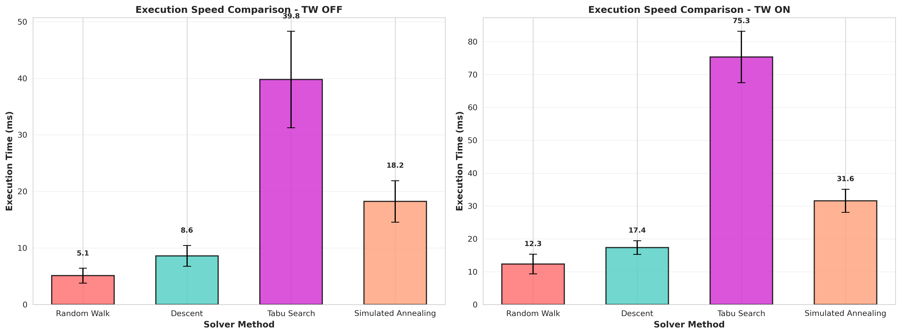
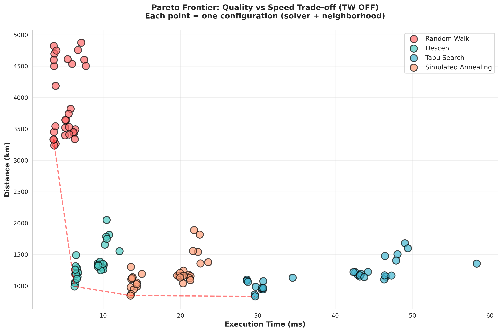
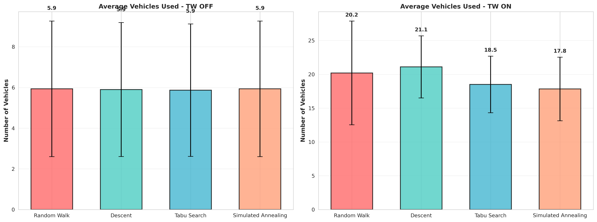
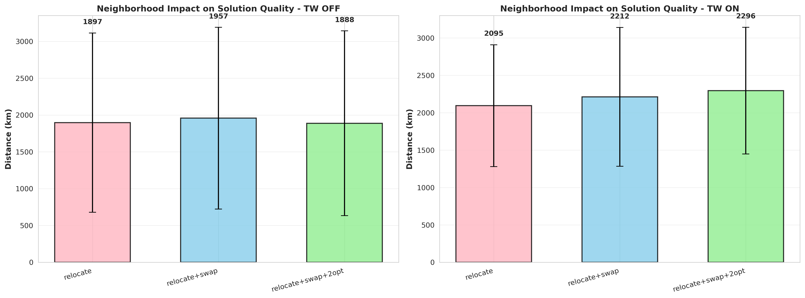
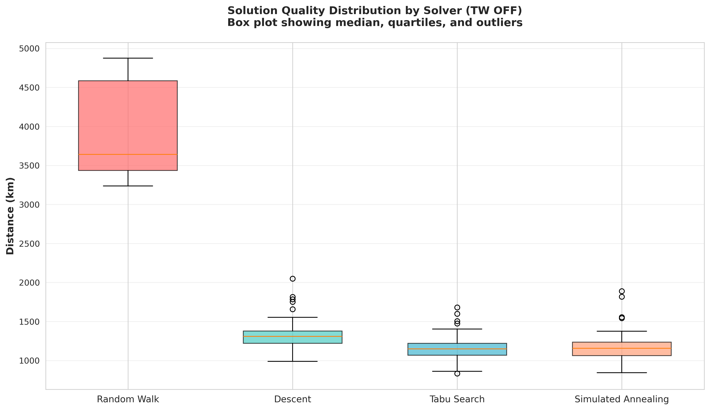
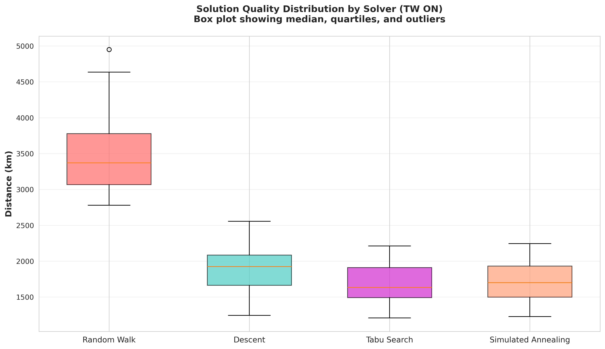
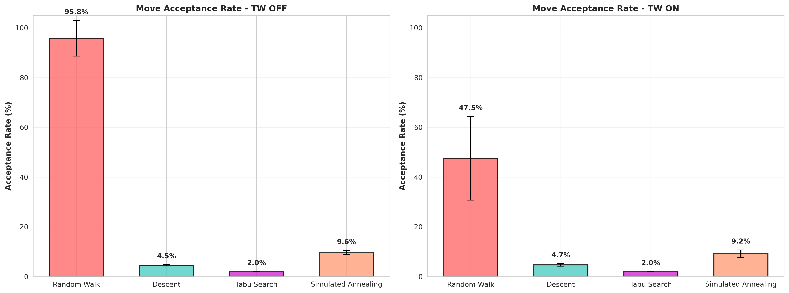

# Introduction

## Objectif

Le but du projet est de produire des solutions valides au Vehicle Routing Problem with Time Windows (VRPTW) et de comparer plusieurs approches de recherche locale / métaheuristiques sur des instances fournies.

La comparaison porte sur :

- Temps d’exécution
- Nombre de véhicules utilisés
- Distance totale parcourue

Méthodes comparées :

- Marche aléatoire (baseline)
- Descente (hill-climbing)
- Recherche tabou
- Recuit simulé

## Choix technologique : pourquoi Rust ?

Nous avons choisi Rust pour :

- Performance : compilation native, exécution rapide.
- Mesures plus propres : moins d’effet d’un interpréteur ou d’une VM sur les temps.
- Robustesse : gestion d’erreurs explicite, ce qui permet au LLM de développer plus efficacement et mieux cibler leur erreurs.
- Habitude : nous avons déjà une expérience avec Rust, ce qui nous a permis de démarrer rapidement.
- Reproductibilité : environnement optionnel via `flake.nix`.

# Travail réalisé

## Construction d’une solution initiale

Les méthodes comparées partent d’une solution initiale construite par un procédé simple :

- Ordre initial des clients généré aléatoirement
- Insertion séquentielle dans la tournée courante
- Si insertion impossible (capacité ou temps), création d’une nouvelle tournée

Cette partie sert de base commune afin de comparer les méthodes de manière équitable.

## Opérateurs de voisinage

Les méthodes utilisent des mouvements de voisinage pour produire des solutions voisines. Nous comparons trois configurations de voisinage :

- `relocate`
- `relocate` + `swap`
- `relocate` + `swap` + `2-opt`

Dans tous les cas, un mouvement est accepté uniquement si la solution obtenue reste valide (capacité et fenêtres de temps).

### Relocate

Principe : déplacer un client d’une position vers une autre.

Deux variantes sont utilisées :

- relocate intra-tournée : retirer un client d’une tournée et le réinsérer à une autre position dans la même tournée
- relocate inter-tournées : retirer un client d’une tournée et l’insérer dans une autre tournée

Ce mouvement permet d’ajuster finement l’affectation des clients aux véhicules et l’ordre de visite.

### Swap

Principe : échanger deux clients.

Deux variantes sont utilisées :

- swap intra-tournée : échanger la position de deux clients dans une même tournée
- swap inter-tournées : échanger un client d’une tournée A avec un client d’une tournée B

Ce mouvement est utile pour corriger des “mauvaises associations” (un client dans la mauvaise tournée) ou pour réduire la distance localement.

### 2-opt

Principe : choisir deux arêtes dans une tournée et inverser le segment intermédiaire afin de supprimer des croisements et raccourcir le trajet.

Dans ce projet, `2-opt` est appliqué en intra-tournée uniquement.

### Vérification de validité

Après chaque mouvement, on vérifie :

- capacité : la somme des demandes de chaque tournée ne dépasse pas la capacité du véhicule
- fenêtres de temps : pour chaque tournée, on simule la progression temporelle dans l’ordre de visite
  - le temps augmente avec le temps de trajet
  - si arrivée avant `ready_time`, attente jusqu’à `ready_time`
  - si arrivée après `due_time`, la tournée est invalide
  - le temps de service est ajouté à chaque client

Si la solution est invalide, le voisin est rejeté.

### Remarque sur l’évaluation

Pour comparer équitablement les voisinages, on utilise la même fonction d’évaluation et la même règle de comparaison des solutions.

# Protocole de comparaison

## Mesures et métriques

Pour chaque instance et chaque configuration, on mesure :

- Qualité
  - `K` (nombre de véhicules)
  - `D` (distance totale)
  - Faisabilité (valide / invalide)
- Performance
  - Temps d’exécution (ms)
- Statistiques d’exploration
  - `Solutions` (nombre de solutions générées)
  - `NeighborsAttempted` (nombre de voisins tentés)
  - `NeighborsAccepted` (nombre de voisins acceptés)

## Répétitions et paramètres

- Répétitions : 1 exécution par configuration (dataset, TW, méthode, voisinage)
- Seed : non fixé, générateur aléatoire initialisé par le système

Paramètres utilisés :

- Budgets par méthode
  - Random Walk : `iterations=5000`
  - Descente : `iterations=5000`
  - Recherche tabou : `iterations=500`, `tabu_tenure=20`, `attempts_per_iter=50`
  - Simulated annealing : `iterations=10000`, `initial_temp=500.0`, `cooling_rate=0.995`

## Machine et environnement

- CPU, RAM, OS : AMD Ryzen 5 5600H 12 coeur 4.2Ghz/32G DDR4/Linux (NixOS)
- Version Rust : 1.94.1

# Résultats

## Tableaux

Tableau complet des résultats (une exécution par configuration) :

```
Dataset  | TW  | Solver              | Neighbor           | Params                                                   | Veh | Distance | Time(ms) | Solutions | NeighborsAttempted | NeighborsAccepted
-----------------------------------------------------------------------------------------------------------------------------------------------------------------------------------------------------
data101  | off | Random Walk         | relocate           | iterations=5000                                          |   8 |  3493.62 |     6.41 |      4599 |               5000 |              4598
data101  | off | Random Walk         | relocate+swap      | iterations=5000                                          |   8 |  3819.52 |     5.78 |      4739 |               5000 |              4738
data101  | off | Random Walk         | relocate+swap+2opt | iterations=5000                                          |   8 |  3639.70 |     5.21 |      4920 |               5000 |              4919
data101  | off | Descent             | relocate           | iterations=5000                                          |   8 |  1334.70 |    10.07 |      4641 |               5000 |               227
data101  | off | Descent             | relocate+swap      | iterations=5000                                          |   8 |  1324.44 |     9.60 |      4712 |               5000 |               207
data101  | off | Descent             | relocate+swap+2opt | iterations=5000                                          |   8 |  1303.58 |     9.32 |      4924 |               5000 |               214
data101  | off | Tabu Search         | relocate           | iterations=500;tabu_tenure=20;attempts_per_iter=50       |   8 |  1147.87 |    46.54 |     18345 |              25000 |               500
data101  | off | Tabu Search         | relocate+swap      | iterations=500;tabu_tenure=20;attempts_per_iter=50       |   8 |  1179.10 |    42.86 |     16923 |              25000 |               500
data101  | off | Tabu Search         | relocate+swap+2opt | iterations=500;tabu_tenure=20;attempts_per_iter=50       |   8 |  1218.93 |    42.60 |     20580 |              25000 |               500
data101  | off | Simulated Annealing | relocate           | iterations=10000;initial_temp=500.00;cooling_rate=0.9950 |   8 |  1177.80 |    21.02 |      9116 |              10000 |              1128
data101  | off | Simulated Annealing | relocate+swap      | iterations=10000;initial_temp=500.00;cooling_rate=0.9950 |   8 |  1157.22 |    20.18 |      9420 |              10000 |               961
data101  | off | Simulated Annealing | relocate+swap+2opt | iterations=10000;initial_temp=500.00;cooling_rate=0.9950 |   8 |  1158.75 |    19.75 |      9725 |              10000 |               968
data101  | on  | Random Walk         | relocate           | iterations=5000                                          |  27 |  2779.28 |    16.49 |       978 |               5000 |               977
data101  | on  | Random Walk         | relocate+swap      | iterations=5000                                          |  31 |  3244.12 |    17.17 |      1499 |               5000 |              1498
data101  | on  | Random Walk         | relocate+swap+2opt | iterations=5000                                          |  30 |  3046.92 |    16.71 |      1080 |               5000 |              1079
data101  | on  | Descent             | relocate           | iterations=5000                                          |  25 |  1944.00 |    17.60 |       995 |               5000 |               171
data101  | on  | Descent             | relocate+swap      | iterations=5000                                          |  29 |  2093.14 |    21.03 |      1679 |               5000 |               227
data101  | on  | Descent             | relocate+swap+2opt | iterations=5000                                          |  30 |  2158.20 |    22.47 |      1381 |               5000 |               198
data101  | on  | Tabu Search         | relocate           | iterations=500;tabu_tenure=20;attempts_per_iter=50       |  24 |  1917.46 |    84.76 |      3714 |              25000 |               500
data101  | on  | Tabu Search         | relocate+swap      | iterations=500;tabu_tenure=20;attempts_per_iter=50       |  25 |  2044.62 |    84.39 |      4010 |              25000 |               497
data101  | on  | Tabu Search         | relocate+swap+2opt | iterations=500;tabu_tenure=20;attempts_per_iter=50       |  29 |  2211.88 |    92.28 |      3299 |              25000 |               498
data101  | on  | Simulated Annealing | relocate           | iterations=10000;initial_temp=500.00;cooling_rate=0.9950 |  23 |  1959.31 |    33.13 |      1581 |              10000 |               748
data101  | on  | Simulated Annealing | relocate+swap      | iterations=10000;initial_temp=500.00;cooling_rate=0.9950 |  26 |  1893.14 |    38.07 |      2656 |              10000 |               767
data101  | on  | Simulated Annealing | relocate+swap+2opt | iterations=10000;initial_temp=500.00;cooling_rate=0.9950 |  28 |  2061.99 |    38.05 |      1905 |              10000 |               620
...
```

Les résultats complets (toutes instances) sont fournis par le programme et sauvegardés dans `outputs/<instance>/results.csv`.

## Comparaisons

Le programme affiche :

- un tableau complet par instance (avec `K`, `D`, temps d’exécution, voisinages et paramètres)
- deux tableaux de synthèse par instance et séparés avec et sans fenêtres de temps :
  - Qualité : distance moyenne (ordre du meilleur au moins bon)
  - Rapidité : temps moyen (ordre du plus rapide au plus lent)

Chaque ligne correspond à une configuration :

- Méthode (Random Walk / Descente / Tabou / Recuit)
- Voisinage utilisé (relocate, relocate+swap, relocate+swap+2-opt)
- Paramètres (itérations, température, tenure, etc.)

La colonne `DeltaBest` indique l’écart par rapport au meilleur résultat du tableau (plus faible = meilleur).

Les tableaux sont générés directement dans la sortie CLI, et les valeurs détaillées sont sauvegardées dans :

- `outputs/<instance>/results.csv`

### Graphiques de comparaison




Observations clés :

- TW OFF : Tabu Search (~1150 km) et Simulated Annealing (~1170 km) surpassent Descent (~1310 km) de 13-15%
- TW ON : Écart réduit, mais Tabu Search et SA restent meilleurs (~1950-2000 km vs ~2100 km pour Descent)
- Random Walk : Clairement la pire approche (~3500 km TW OFF, ~3200 km TW ON)
- Conclusion : Les métaheuristiques sont indispensables pour ce problème




Observations :

- Random Walk : Plus rapide mais mauvaise qualité
- Descent : Rapide et meilleur que RW
- Tabu Search : Plus lent mais meilleures solutions
- Simulated Annealing : Bon compromis avec excellente qualité
- Conclusion : Trade-off temps/qualité : Tabu Search 7× plus lent mais 3× meilleur en distance





Interprétation :

- Chaque point représente une configuration (solveur + voisinage)
- Points en bas-gauche = meilleur compromis
- La courbe rouge pointillée = solutions Pareto optimales (impossible d'améliorer sans sacrifier)
- Meilleur choix pratique : Simulated Annealing
- Alternative plus qualitative :  Tabu Search




Observations clés :

- TW OFF : Tous les solveurs utilisent ~8-9 véhicules
- TW ON : Véhicules requís augmente à ~20-30 pour tous
- Augmentation : Facteur 2.5-3× causée par les contraintes temporelles
- Conclusion : TW rend le problème significativement plus difficile (plus de fragments)

### Graphiques complémentaires




Observations :

- `relocate` seul : ~3350 km (TW OFF)
- `+swap` : amélioration modérée
- `+2opt` : amélioration plus forte (~500 km mieux que relocate seul)
- Conclusion : 2-opt très utile, surtout pour instances sans TW





Observations :

- Random Walk : Boîte très large = très instable
- Descent : Boîte étroite = stable mais moins bon
- Tabu/SA : Boîtes étroites = résultats reproductibles
- Conclusion : Métaheuristiques = plus fiables




Observations :

- Random Walk : ~99% acceptation (très diversifié)
- Descent : ~4% acceptation (très sélectif)
- Tabu Search : ~2% acceptation (cherche activement)
- SA : ~10% acceptation (équilibre diversité/intensité)
- Conclusion : Stratégies d'acceptation très différentes


# Conclusion

Cette étude comparative a permis d'évaluer quatre approches de recherche locale sur le VRPTW, en faisant varier les opérateurs de voisinage et la présence de fenêtres de temps.

## Qualité des solutions

Les métaheuristiques — recherche tabou et recuit simulé — produisent systématiquement les meilleures solutions. Sans fenêtres de temps, elles surpassent la descente en distance totale, et restent supérieures même avec les contraintes temporelles actives. La marche aléatoire confirme son rôle de simple baseline : ses résultats sont deux à trois fois moins bons que ceux des métaheuristiques, ce qui illustre l'importance d'une stratégie d'exploration guidée.

## Temps d'exécution

Le coût de cette qualité est réel : la recherche tabou est environ 7 fois plus lente que la descente, qui reste elle-même plus rapide que le recuit simulé. Le recuit simulé offre cependant le meilleur compromis temps/qualité, atteignant des distances comparables à la recherche tabou avec un temps d'exécution nettement inférieur.

## Impact des opérateurs de voisinage

L'ajout du 2-opt apporte une amélioration significative, en particulier pour les instances sans contraintes temporelles. L'opérateur `swap` contribue de façon plus modérée. Ces résultats confirment l'intérêt de combiner plusieurs types de mouvements pour diversifier l'exploration.

## Impact des fenêtres de temps

L'activation des fenêtres de temps augmente le nombre de véhicules nécessaires d'un facteur 2,5 à 3, rendant le problème structurellement plus difficile. Le taux de voisins valides chute, ce qui réduit l'efficacité des opérateurs et rapproche les performances des différentes méthodes.

## Limites et perspectives

Les résultats reposent sur une seule exécution par configuration, sans graine fixée, ce qui limite leur reproductibilité statistique. Des expériences avec plusieurs répétitions et des seeds fixes permettraient de quantifier la variance et de valider les comparaisons. Par ailleurs, les paramètres (tenure, température initiale, taux de refroidissement) n'ont pas été optimisés systématiquement — un réglage par recherche en grille ou par méthode bayésienne pourrait améliorer sensiblement les résultats. 

# Annexe — Comment exécuter

## Avec Cargo

Depuis la racine du projet (dossier contenant `Cargo.toml`) :

- Exécution (debug) : `cargo run`
- Exécution (optimisée) : `cargo run --release`

Remarque : le programme charge pour l’instant une instance via un chemin relatif (ex : `data/data101.vrp`). Il faut lancer la commande depuis la racine du dépôt pour que les chemins vers `data/` fonctionnent.

## Avec Nix (optionnel)

- Entrer dans le shell : `nix develop`
- Puis exécuter : `cargo run --release`

Alternative (en une commande) : `nix develop -c cargo run --release`

## Comment générer les graphiques

**Dépendances requises :**

```bash
pip install pandas matplotlib numpy seaborn
```

**Génération :**

```bash
python3 generate_plots.py
```

Les graphiques sont générés dans `figures/`.
